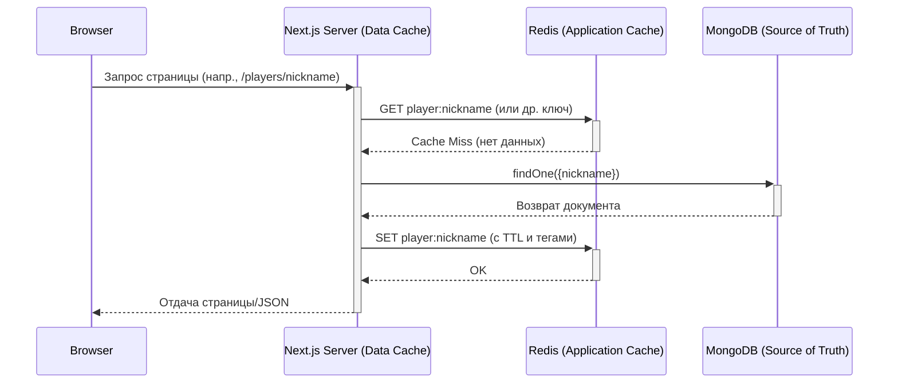

# Эталонная архитектура кэширования

> **Цель:** Обеспечить максимальную производительность для публичного портала и идеальную отзывчивость и актуальность данных в административной панели, используя многоуровневый подход.

---

## 1. Многоуровневая стратегия

Мы используем трехуровневую систему кэширования, где каждый последующий уровень защищает более медленный предыдущий.



| Уровень              | Инструмент            | Назначение                                                 | TTL / Стратегия инвалидации                                           |
| -------------------- | --------------------- | ---------------------------------------------------------- | --------------------------------------------------------------------- |
| **Клиентский кэш**   | SWR / React Query     | Мгновенный UI, optimistic updates, `stale-while-revalidate`. | `revalidateOnFocus`, ручная инвалидация через `mutate()`.               |
| **Кэш данных Next.js** | `unstable_cache`, `fetch` | Публичный контент (профили, рейтинги), статические страницы. | `revalidateTag('tag-name')`.                                          |
| **Прикладной кэш**     | Redis                 | Тяжелые запросы, агрегации, пагинированные списки.         | Короткий TTL + инвалидация по тегам и **счетчикам ревизий**.        |
| **Источник правды**    | MongoDB               | Надежное хранение всех данных.                             | -                                                                     |

---

## 2. Паттерны и реализация

### 2.1. Паттерн "Cache-Aside" и Адаптер кэша

Вся работа с Redis инкапсулирована в едином `cache-adapter`, который реализует паттерн "Cache-Aside". Прямой доступ к Redis из сервисов запрещен.

```typescript
// src/lib/cache/index.ts (Примерная реализация)
export async function getOrSet<T>(
  key: string,
  tags: string[],
  fetcher: () => Promise<T>,
  ttl: number
): Promise<T> {
  const cached = await redis.get(key);
  if (cached) return JSON.parse(cached);

  const freshData = await fetcher();
  
  // Атомарно сохраняем данные и привязываем к тегам
  const pipeline = redis.pipeline();
  pipeline.set(key, JSON.stringify(freshData), 'EX', ttl);
  for (const tag of tags) {
    pipeline.sadd(tag, key); // Добавляем ключ в множество тега
  }
  await pipeline.exec();

  return freshData;
}
```

### 2.2. Инвалидация кэша

Инвалидация происходит на уровне сервисов после успешной операции записи.

```typescript
// src/lib/domain/players/player-service.ts (Пример)
async function updatePlayer(id, data) {
  // 1. Обновляем данные в MongoDB
  const updatedPlayer = await playerRepo.update(id, data);
  
  // 2. Асинхронно запускаем обновление поискового индекса
  await searchQueue.add('update', { entity: 'Player', entityId: id });
  
  // 3. Инвалидируем кэши
  await cache.invalidateByTags(['player:' + id, 'players:list']);
  await revalidateTag('player-profile:' + updatedPlayer.slug); // Для Next.js Data Cache
  
  return updatedPlayer;
}
```

### 2.3. Инвалидация списков через счетчики ревизий

Чтобы не удалять сотни ключей для пагинированных списков, мы используем "счетчики ревизий".

1.  **Формирование ключа:** `players:list:p{page}:l{limit}:rev{N}`
2.  **Получение ревизии:** Перед запросом списка мы получаем текущий номер ревизии `N` из `redis.get('rev:players:list')`.
3.  **Инвалидация:** При любом изменении, затрагивающем список, мы просто выполняем `redis.incr('rev:players:list')`. Все новые запросы будут формировать ключи с `rev{N+1}` и гарантированно не найдут старый кэш, который умрет по TTL.

---

## 3. Отказоустойчивость: Паттерн "Circuit Breaker"

Чтобы падение Redis не приводило к отказу всего приложения, мы используем "размыкатель цепи" в нашем Redis-клиенте, предназначенном для API.

```typescript
// src/lib/redis-clients.ts (Упрощенная логика)

let failures = 0;
let isTripped = false;

const apiClient = new IORedis(/** ... **/);

apiClient.on('error', () => {
  failures++;
  if (failures > 5) {
    isTripped = true;
    console.error('Redis Circuit Breaker TRIPPED!');
    // Взводим таймер, чтобы через минуту попробовать снова
    setTimeout(() => {
      isTripped = false;
      failures = 0;
      console.log('Redis Circuit Breaker RESET.');
    }, 60000);
  }
});

// Наш адаптер кэша должен проверять этот флаг
// if (isTripped) return fetcher();
```

Если размыкатель "разомкнут", все запросы к кэшу автоматически промахиваются и идут напрямую в базу данных, замедляя ответ, но сохраняя работоспособность системы.
