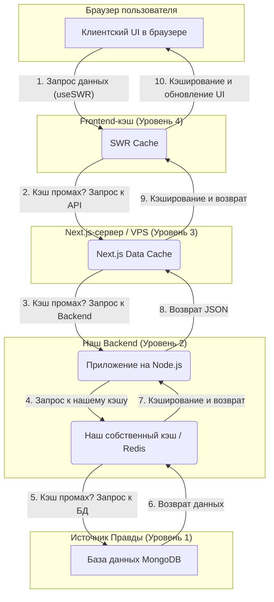

# Стратегия кэширования: Многоуровневый подход

Этот документ описывает многоуровневую стратегию кэширования в проекте Majestic Match Center. Наша цель — достичь максимальной производительности для публичных страниц и идеальной отзывчивости и актуальности данных в административной панели.

## 1. Философия и модель "Пирамиды кэша"

Мы рассматриваем кэширование как пирамиду, где на каждом уровне мы пытаемся отдать данные как можно быстрее, минимизируя нагрузку на самый медленный уровень — базу данных.

---

## 2. Разбор уровней

### Уровень 1: Источник Правды — MongoDB
*   **Задача:** Хранить все данные надежно.
*   **Проблема:** Это самый медленный компонент системы. Наша цель — обращаться к нему как можно реже.

### Уровень 2: Backend-кэш — Redis (`cache-adapter`)
*   **Задача:** Защитить базу данных от повторяющихся запросов с нашего бэкенда.
*   **Реализация:** Паттерн "Cache-Aside" через наш `cache-adapter`. Прямой доступ к Redis из сервисов запрещен.
*   **Принцип работы:**
    1.  Сервис запрашивает данные у репозитория.
    2.  Репозиторий сначала ищет данные в Redis по ключу (например, `player:123`).
    3.  **Попадание:** Данные мгновенно возвращаются из Redis.
    4.  **Промах:** Репозиторий идет в MongoDB, получает данные, **сохраняет их в Redis с тегами** и возвращает сервису.
*   **Инвалидация:** При любом изменении данных (`create`, `update`, `archive`) репозиторий **обязан** инвалидировать кэш по тегам (`cache.invalidateByTag('player:123')`).

### Уровень 3: Next.js Data Cache (кэш на VPS)
*   **Задача:** Защитить весь наш бэкенд (Node.js + Redis) от лишних вызовов. Кэширует готовые ответы API (`JSON`) или отрендеренные страницы (`HTML`).
*   **Где живет:** При деплое на VPS, это папка на диске нашего сервера (`.next/cache/`).
*   **Принцип работы:**
    1.  **По умолчанию ВЫКЛЮЧЕН** (согласно Next.js 15).
    2.  **Включение:** Мы включаем его для конкретных маршрутов с помощью экспорта `export const dynamic = 'force-static'`. Это идеально для публичных страниц.
    3.  **Инвалидация:** Управляется **исключительно нами** через функцию `revalidateTag('tag-name')` из `next/cache`. Эту команду мы вызываем в `POST`, `PATCH`, `DELETE` маршрутах после успешного изменения данных.

### Уровень 4: Frontend-кэш — SWR (в браузере)
*   **Задача:** Обеспечить максимальную отзывчивость UI ("Perceived Performance") и синхронизировать данные между несколькими администраторами.
*   **Принцип работы:** Паттерн **"Stale-While-Revalidate"**.
    1.  При навигации SWR мгновенно показывает данные из своего кэша (если они есть).
    2.  Одновременно в фоне он отправляет запрос на сервер для проверки актуальности.
    3.  Если с сервера приходят новые данные, UI плавно обновляется.
*   **Автоматическая ревалидация:** SWR сам делает повторный запрос, когда пользователь возвращается на вкладку браузера. Это решает проблему "AFK-администратора".

---

## 3. Практическая реализация и стратегии

### Стратегия для Админ-панели
*   **Серверный кэш (Уровень 3):** Отключен. Нам нужна максимальная актуальность при каждом заходе в раздел.
*   **Backend-кэш Redis (Уровень 2):** Включен. Ускоряет ответы API.
*   **Клиентский кэш SWR (Уровень 4):** Включен. Обеспечивает "живой" и отзывчивый интерфейс, решает проблему синхронизации.

### Стратегия для Публичных страниц

#### А. Страницы конкретных сущностей (`/players/[slug]`)
*   **Подход:** «Хирург».
*   **Реализация:**
    1.  На странице используется `export const dynamic = 'force-static'`.
    2.  Запрос данных (`fetch`) помечается уникальным тегом: `next: { tags: ['player-profile:tom-gucci'] }`.
    3.  При обновлении профиля в админке, API вызывает `revalidateTag('player-profile:tom-gucci')`.
*   **Результат:** Мгновенная загрузка страниц по всему миру, точечная инвалидация.

#### Б. Страницы списков (`/players`, `/families`)
*   **Подход:** «Генерал».
*   **Реализация:**
    1.  На странице используется `export const dynamic = 'force-static'`.
    2.  Запрос данных помечается общим тегом: `next: { tags: ['players-list'] }`.
    3.  При создании/изменении/удалении **любого** игрока, API вызывает `revalidateTag('players-list')`.
*   **Результат:** Быстрая загрузка общих страниц.

#### В. Главная страница (смешанный контент)
*   **Подход:** «Телеведущий» (Partial Prerendering).
*   **Реализация:**
    1.  Страница строится как статическая "оболочка".
    2.  **Каждый компонент** (`TopPlayers`, `LatestNews`) получает данные со своим тегом кэша (`top-players-list`, `latest-news`).
    3.  Ревалидация происходит **покомпонентно**. Обновление новости не затрагивает кэш топ-игроков.
*   **Результат:** Максимальная производительность для страниц со сложным, смешанным контентом.
