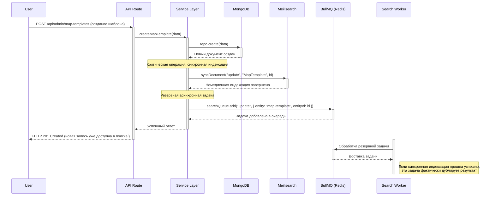

# Эталонная архитектура: Асинхронные операции и Real-time

> **Цель:** Обеспечить надежную, масштабируемую и отказоустойчивую обработку фоновых задач (например, индексация в поиске) и заложить основу для будущих real-time функций.

---

## 1. Ядро системы: BullMQ + Redis

Все асинхронные операции в системе выполняются через библиотеку **BullMQ**, которая использует Redis как надежное хранилище для очередей задач.

### 1.1. Основной пайплайн (на примере синхронизации с Meilisearch)

Это наш главный асинхронный процесс. Он гарантирует, что операции записи в основную базу данных (MongoDB) остаются быстрыми и не зависят от доступности внешних сервисов (например, Meilisearch).

**Обновление (Январь 2025):** Для критических операций создания новых сущностей добавлена **синхронная индексация** в дополнение к асинхронной, обеспечивающая немедленное появление новых записей в поиске.



**Преимущества гибридного подхода:**
- ✅ **Немедленная доступность** новых записей в поиске
- ✅ **Надежность** через резервную асинхронную задачу
- ✅ **Отказоустойчивость** - API не падает при сбое индексации

### 1.2. Воркеры (Workers)

*   **Назначение:** Изолированные процессы (Node.js), которые подключаются к очередям BullMQ и выполняют тяжелую работу.
*   **Реализация:** `src/queues/search-worker.ts`
*   **Отказоустойчивость:** Мы используем **"retry-forever"** Redis-клиент для воркеров. Если воркер теряет связь с Redis, он будет пытаться переподключиться бесконечно, чтобы не потерять задачи после восстановления связи.
*   **Graceful Shutdown:** Воркеры корректно обрабатывают сигналы `SIGINT` и `SIGTERM` (например, от Docker), завершая текущую задачу перед выходом, что предотвращает потерю данных.

### 1.3. Мониторинг очередей

*   **Проблема:** Как отслеживать сбои в фоновых задачах?
*   **Решение:** Вместо устаревшего `QueueScheduler`, мы используем **`QueueEvents`** из BullMQ v5+.
*   **Реализация:** `src/queues/run-queue-monitor.ts` — отдельный легковесный процесс, который слушает события (`failed`, `completed`, `stalled`) из очередей и логирует их, что позволяет настроить алертинг.

---

## 2. Ключевые паттерны надежности

### 2.1. Идемпотентность задач

*   **Проблема:** Как гарантировать, что одна и та же задача (например, обновление индекса для игрока) не будет выполнена дважды, если произойдет сбой?
*   **Решение:** Мы используем уникальный и детерминированный `jobId` для каждой задачи.
*   **Формат `jobId`:** `{entityType}:{entityId}:{schemaVersion}` (например, `player:60f5a7bda6c3b9001f7b8b17:v1`).
*   **Результат:** Попытка добавить в очередь задачу с уже существующим `jobId` будет проигнорирована BullMQ, что гарантирует идемпотентность.

### 2.2. Планирование периодических задач (Cron Jobs)

*   **Проблема:** Как выполнять регулярные задачи (например, ежедневный бэкап, активация турниров по расписанию)?
*   **Решение:** Мы **не используем** встроенный механизм BullMQ Repeatable Jobs, так как он менее гибок в управлении. Вместо этого мы используем стандартный `cron`, управляемый утилитой **`supercronic`** в нашем `docker-compose.yml`.
*   **Принцип работы:**
    1.  Создается `crontab` файл с расписанием.
    2.  `supercronic` запускает `node` скрипты, которые добавляют разовые задачи в очередь BullMQ.
*   **Преимущества:** Простота, надежность, стандартный для DevOps-индустрии подход.

```yaml
# docker-compose.yml (Пример)
services:
  # ...
  cron:
    build: .
    command: supercronic /path/to/crontab
    # ...
```

---

## 3. Real-time на клиенте (TanStack Query v5)

Для создания "живого" интерфейса в админ-панели мы используем **TanStack Query v5**.
*   **Stale-While-Revalidate:** Мгновенный показ данных из кэша с фоновым обновлением.
*   **Автоматическая ревалидация:** TanStack Query автоматически обновляет данные при фокусе окна и переподключении к сети, решая проблему "устаревших данных" без необходимости в WebSocket.
*   **Синхронизация между администраторами:** Изменения, сделанные одним администратором, становятся видны другим при их следующем взаимодействии со страницей или при автоматическом рефокусе окна.
